<h1> - easyChart - </h1>

Welcome to easyChart – your easy way to create a simple chart quickly!

Do you need a quick visualization? An effortless way of displaying a few data points?
That's what easyChart is all about. Your rendered chart is downloadable as a JPG with a click of a button—right at your fingertips.

### What Sets Us Apart?

- **Accessibility**: easyChart features an easy-to-use, straightforward interface with example data for seamless engagement. No registration, no navigation, and no hidden features—everything you need is right in front of you with no hurdles.

[**Deployed Site**: easyChart](https://csclown.github.io/easyChart/)

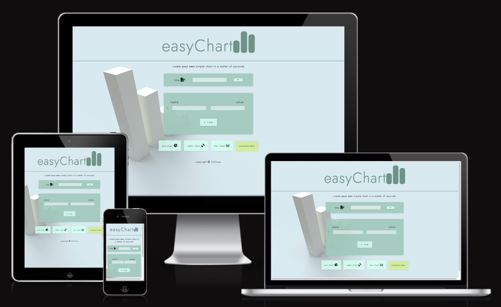

# Contents

- [User Experience (UX)](#user-experience-ux)
  - [Wireframes](#wireframes)
  - [Site Structure](#site-structure)
  - [Design Choices](#design-choices)
    - [Typography](#typography)
    - [Color Scheme](#color-scheme)
- [Features](#features)
    - [Title Setter](#title-setter)
    - [Data Setter](#data-setter)
    - [Chart Type Selector](#chart-type-selector)
    - [Example Data](#example-data)
    - [Chart Canvas](#chart-canvas)
- [Future Features](#future-features)
- [Technologies Used](#technologies-used)
- [Testing](#testing)
- [Deployment](#deployment)
- [Credits](#credits)
    - [Content](#content)
    - [Media](#media)
- [Acknowledgements](#acknowledgements)

# User Experience (UX)

## Wireframes

The wireframes for easyChart were produced in [Figma](https://www.figma.com/). Frames were created for small mobile devices. The final site may differ from the wireframes due to developments during the creation process.

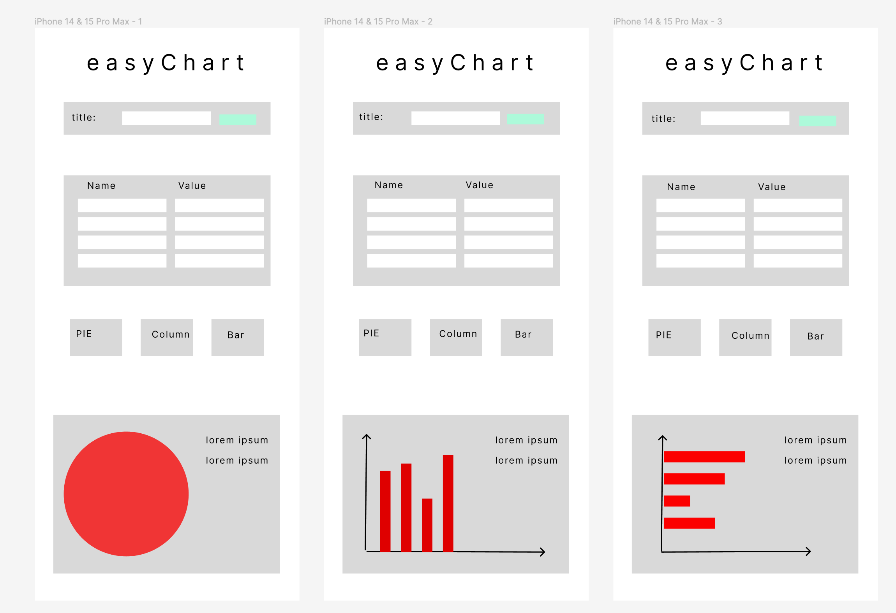

[Back to top](#contents)

## Site Structure

The easyChart website only needs one page. It is a one-trick-pony and doesn't pretend otherwise. It contains four sections:

- Set the title
- Set the data
- Choose the chart style
- Chart canvas

[Back to top](#contents)

## Design Choices

- ### Typography

  The chosen font is 'Jost', which falls back to sans-serif when needed.

- ### Color Scheme

  The color scheme is minimalistic and pastel for a pleasant appearance, low distraction, and content focus.

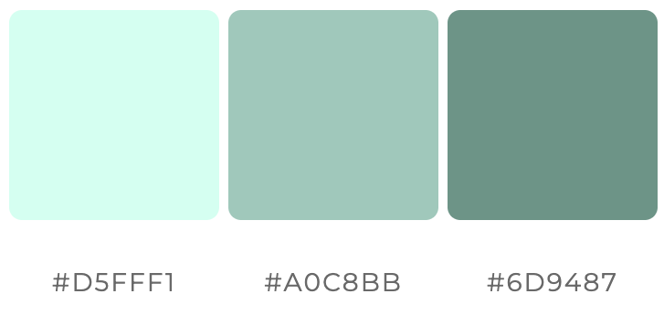

[Back to top](#contents)

# Features

easyChart is designed to be user-friendly and inviting. All features are on one page and simple to understand.

## Existing Features

- ### Title Setter

  - Positioned at the top, the input field automatically focuses, allowing users to set the chart title. The interface switches to display the title after it is set and features a "rename" button on the set title.

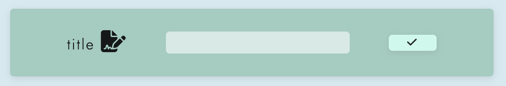
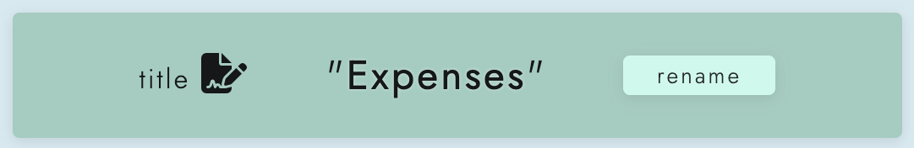

[Back to top](#contents)

- ### Data Setter

  - The data setter contains input fields for custom user data points and can be expanded by adding rows. It allows the selective removal of data points by deleting rows.

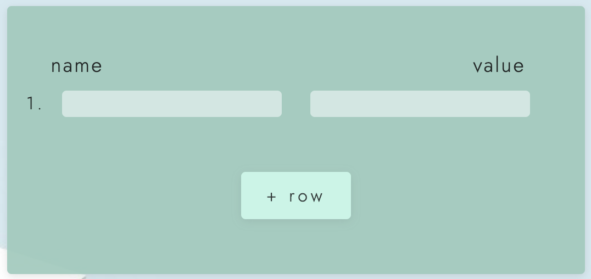
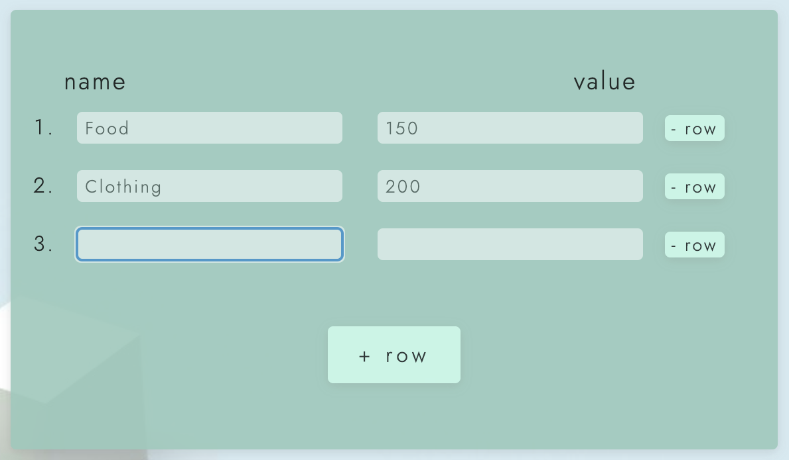

[Back to top](#contents)

- ### Chart Type Selector

  - The chart type selector offers three options for visualizing your data: pie chart, radar chart, and bar chart.

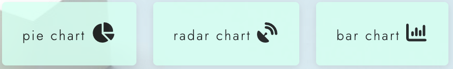

[Back to top](#contents)

- ### Example Data

  - To test chart types or get an impression of how the app works or how a data set might look, click on the example data button. You may then choose between the different chart types to display the information in several ways.

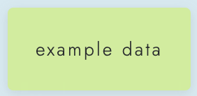

[Back to top](#contents)

- ### Chart Canvas

  - The chart canvas displays the chosen chart type.

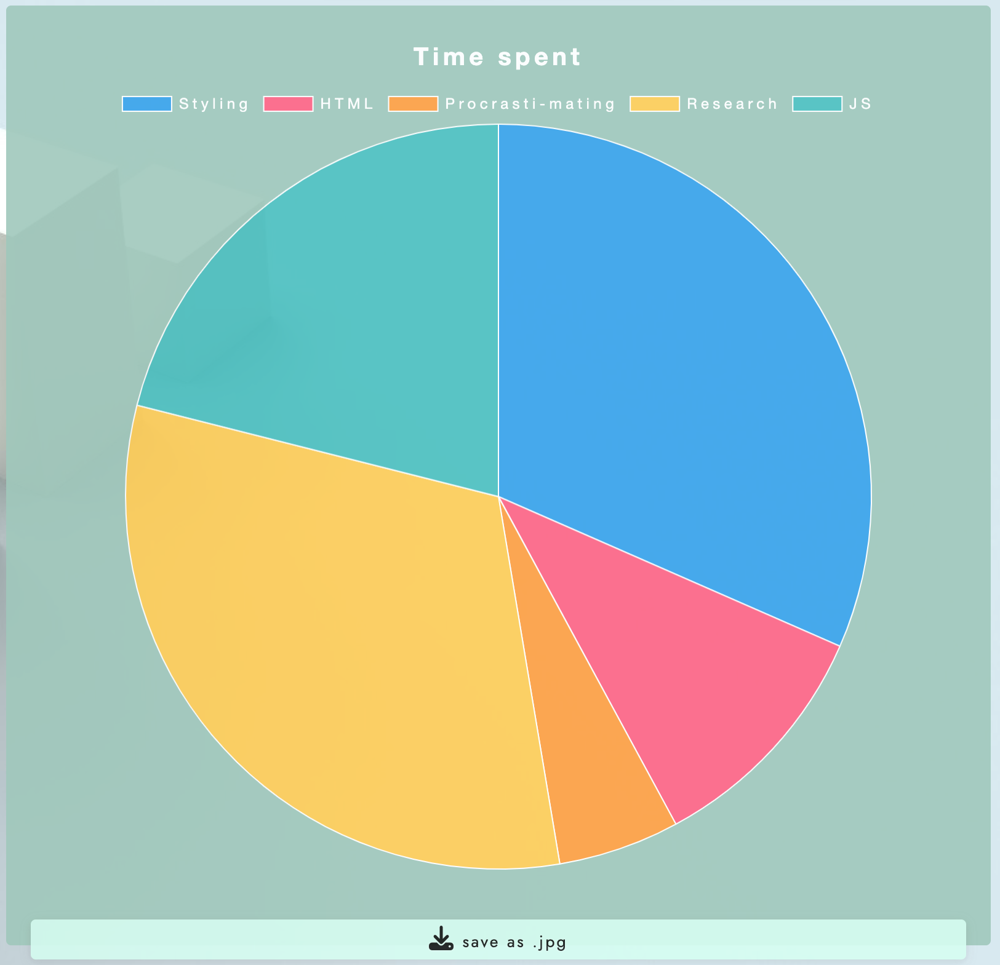
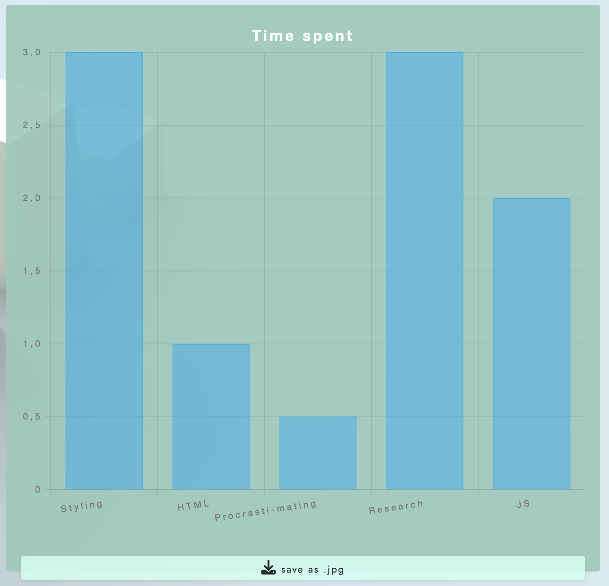

[Back to top](#contents)

- ### Download Chart to JPG

  - The user can save the chart as a JPG to share or use as desired. The filename is automatically derived from the title name, with spaces replaced by underscores in the format "Title_name_easyChart.jpg."

[Back to top](#contents)

## Future Features

- More chart type options
- Two data sets in one chart
- Upload CSV file to populate data sets
- Store data sets locally

[Back to top](#contents)

# Technologies Used

- [HTML5](https://html.spec.whatwg.org/) - Provides the content and structure for the website.
- [CSS](https://www.w3.org/Style/CSS/Overview.en.html) - Provides the styling.
- [JavaScript](https://ecma-international.org/publications-and-standards/standards/ecma-262/) - Provides the DOM manipulation and handling of Data.
- [Figma](https://www.figma.com/) - Used to create the wireframes.
- [Gitpod](https://www.gitpod.io/) - Used to deploy the website.
- [GitHub](https://github.com/) - Used to host and edit the website.

[Back to top](#contents)

# Testing

Please refer to [here](TESTING.md) for more information on testing easyChart.

[Back to top](#contents)

# Deployment

### To Deploy the Project

The site was deployed to GitHub Pages. The steps to deploy a site are as follows:

1. In the GitHub repository, navigate to the **Settings** tab.
2. In Settings, go to the **Pages** tab on the left-hand side.
3. Under **Source**, select the branch **main**, then click **Save**.
4. Once the main branch has been selected, the page will automatically refresh with a detailed ribbon display to indicate the successful deployment.

The live link to the GitHub repository can be found here: [easyChart Repository](https://github.com/CsClown/easyChart).

### To Fork the Repository on GitHub

You can fork the GitHub repository to create a copy. This copy can be viewed and changes can be made to the copy without affecting the original repository. Follow these steps to fork the repository:

1. Log in to **GitHub** and locate the [repository](https://github.com/CsClown/easyChart).
2. On the right side of the page, inline with the repository name, click the **Fork** button to create a copy of the original repository in your GitHub account.

### To Create a Local Clone of This Project

You can clone the GitHub project using the following method:

1. Under the repository name, click on the **Code** tab.
2. In the **Clone with HTTPS** section, click the clipboard icon to copy the provided URL.
3. In your IDE of choice, open **Git Bash**.
4. Change the current working directory to where you want the cloned directory to be located.
5. Type **`git clone`**, and then paste the URL copied from GitHub.
6. Press **Enter** to create the local clone.

[Back to top](#contents)

# Credits

### Content

- The font came from [Google Fonts](https://fonts.google.com/).
- The icons came from [Font Awesome](https://fontawesome.com/).
- [Figma](https://www.figma.com/) was used to create the wireframes.

### Media

- The background image was derived from [Unsplash](https://unsplash.com/).
- The images were compressed using [Compressor](https://compressor.io/).

[Back to top](#contents)

# Acknowledgements

The site was completed as a Portfolio 2 Project piece for the Full Stack Software Developer (e-Commerce) Diploma at the [Code Institute](https://codeinstitute.net/). I would like to thank my mentor [Precious Ijege](https://www.linkedin.com/in/precious-ijege-908a00168/), the Slack community, and everyone at the Code Institute for their help and support.

Stefan Ruppe. 2024

[Back to top](#contents)
```