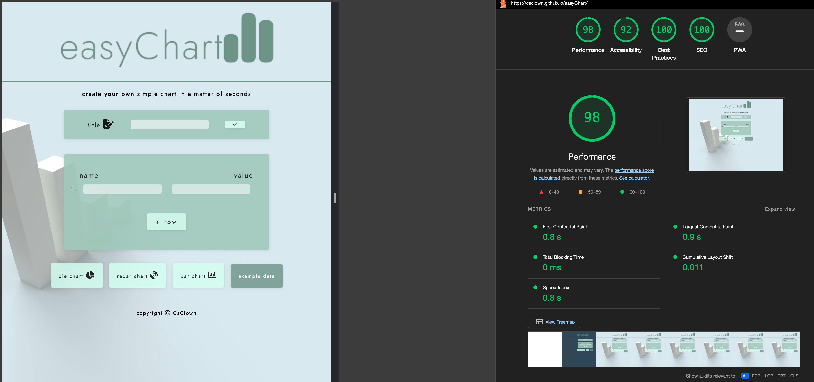

# Testing
## Code Validation
The easyChart site has been thoroughly tested. All the code has been run through the [W3C HTML Validator](https://validator.w3.org/) and the [W3C CSS Validator](https://jigsaw.w3.org/css-validator/). Minor errors were found on the home and inspiration pages. After fixing and retesting, no errors were found for both pages.

## Responsiveness Test
* The responsive design tests were carried out manually using [Google Chrome DevTools](https://developer.chrome.com/docs/devtools/) and [Responsive Design Checker](https://www.responsivedesignchecker.com/).

|        | Google Pixel | Galaxy S5 | iPhone 5 | iPad | iPad Pro | Display <1200px | Display >1200px |
|--------|--------------|-----------|----------|------|----------|-----------------|-----------------|
| Render | pass         | pass      | pass     | pass | pass     | pass            | pass            |
| Images | pass         | pass      | pass     | pass | pass     | pass            | pass            |
| Links  | pass         | pass      | pass     | pass | pass     | pass            | pass            |

Note: On wide display types, the content of the site is restricted in width to 1150px. This helps with the UX by preventing the content from spreading too wide on very large screens.

## Browser Compatibility
The easyChart site was tested on the following browsers:

* Google Chrome
* Microsoft Edge
* Safari
* Mozilla Firefox

**Observations**: On Safari, the fonts are rendered differently and appear a little smaller.

## Known Bugs
### Resolved
* **Landscape orientation for mobile**: Landscape orientation for mobile doesn't work (Apple doesn't support the required API). The decision was made to switch to JS charts instead of Google charts and remove the feature. JS charts offer better responsive configuration.
* **Title naming**: After implementing JS charts and removing Google charts, the title naming didn't work anymore. Realization: If JS throws a compilation error, nothing works. I found a code error elsewhere and fixed it. Lesson learned.
* **"+row" button**: The "+row" button didn't work after implementing the DOM change with an example chart. Fixed by changing the event listeners to parent and addressing the element with 'target.matches'.
* **Button hover effects**: Not consistent. Resolved through better CSS targeting.
* **Empty title input**: Check for empty title input didn't work if executed once with Enter. Enter-input doesn't work after the first input with Enter. Resolved by not reacting to an empty input field and keeping the default title.
* **"Create your own data set"**: When users clicked on "create your own data set," the title wasn't the set title but "generic chart." Resolved through `js.click()` on `rename-btn` to reset the title-setter.
* **Focus() method**: The `focus()` method doesn't work on the "+row" button. Resolved: It actually does work but only selects the element for keyboard input, not the mouse cursor. Removed feature due to ugly frame around button element (e.g., in Safari browser).
* **Active chart indicator**: Doesn't reset on data wipe. Resolved by adding the `resetActive()` function.
* **Chart image download**: Downloads as PNG in Firefox instead of JPG. Fixed typo: JPG -> JPEG in dataURL.

### Unresolved
* (Unresolved issues can be added here.)

## Additional Testing
### Lighthouse
The site was also tested using [Google Lighthouse](https://developers.google.com/web/tools/lighthouse) in Chrome Developer Tools to test each of the pages for:
* Performance: How the page performs while loading.
* Accessibility: Is the site accessible to all users, and how can it be improved?
* Best Practices: Site conforms to industry best practices.
* SEO: Search engine optimization. Is the site optimized for search engine result rankings?

As an example, the results for the easyChart home page are shown below:

This part of the testing process revealed that the accessibility was at 79%. By adding `aria-labels`, I was able to increase it to 92%.

### Peer review
In addition to the above testing, the beta version of the site was tested by peers, both within and outside the software development field.

Back to [README.md](./README.md#contents).
