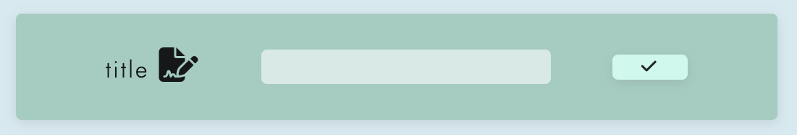
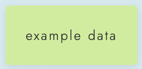
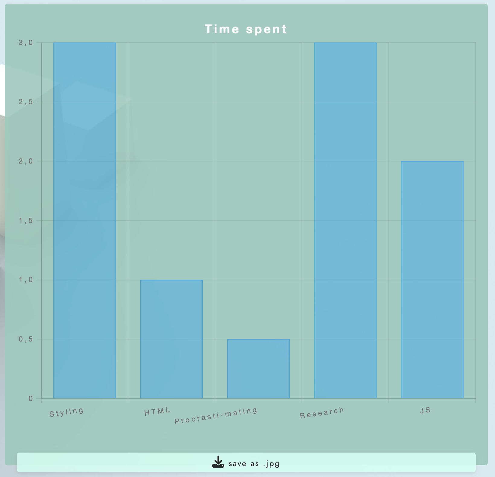

<h1>  - easyChart -  </h1>

Welcome to easyChart – Your easy way to create a simple chart fast!

You need a quick visualization? An effortless way of displaying a few data points?
Thats what easyChart is all about. And your rendered chart is downloadable as JPG by a click of a button - right at your fingertips (or cursor).

What Sets Us Apart?

- Accessability - easy to use, simple to understand interface with example data for seemless engagement. No registration, no navigation, no hidden features - everything you need is right in front of you with no hurdles.

#### -- deployed site -- -> <a href="https://csclown.github.io/easyChart/" target="_blank" rel="noopener">easyChart</a> <-

# Contents

- [**User Experience UX**](#user-experience-ux)
  - [Wireframes](#wireframes)
  - [Site Structure](#site-structure)
  - [Design Choices](#design-choices)
  - [Typography](#typography)
  - [Color Scheme](#color-scheme)
- [**Features**](#features)
    - [Title setter](#title setter)
    - [Data setter](#data setter)
    - [Memes](#memes)
    - [Contact](#contact)
    - [Footer](#footer)
    - [Form Confirmation](#form-confirmation)
  - [**Future Features**](#future-features)
- [**Technologies Used**](#technologies-used)
- [**Testing**](#testing)
- [**Deployment**](#deployment)
- [**Credits**](#credits)
  - [**Content**](#content)
  - [**Media**](#media)
- [**Acknowledgements**](#acknowledgements)

# User Experience (UX)

## Wireframes

The wireframes for easyChart were produced in [Figma](https://figma.com). There are frames for a full width display and a small mobile device. The final site varies from the wireframes due to developments that occurred during the creation process.

[Back to top](#contents)

## Site Structure

The easyChart website needs only one page. Its an one-trick-pony and doesnt pretend otherwise.  
You got four sections:

- Set the title
- Set the Data
- Choose the chart style
- Chart canvas

[Back to top](#contents)

## Design Choices

- ### Typography

  The font chosen is 'Jost'. It falls back to sans-serif.

- ### Color Scheme

  The color scheme is minimalistic pastel for pleasent appearance, low distraction and content focus.
  

[Back to top](#contents)

# Features

easyChart is designed to be user-friendly and inviting. All features are on one page and simple to understand

## Existing Features

- ### Title setter

  - Positioned at the top and automatically focussed is the input field to set the title of the users chart. Switches to display the title after it is set. Features a "rename"-button on a set title

[Back to top](#contents)

- ### Data setter
  - The data setter contains input fields for custom user data points. Expandable at will by adding rows. Features the selective removal of data points by deleting rows.

[Back to top](#contents)

- ### Chart Type Selector

  - The chart type selector offers you three options of visualizing your data.
    Pie-chart, Radar-chart and Bar-chart.

[Back to top](#contents)

- ### Example Data

  - If you want to test the chart types or want to get an impression what the app does or how a data set might look, click on the example data button. You may then choose between the different chart types to display the information in several ways

[Back to top](#contents)

- ### Chart canvas
  - The chart canvas displays when a chart type is chosen.

[Back to top](#contents)

- ### Download Chart to JPG
  - The user is able to save the chart as a JPG to share or implement at his will.
    the filename is automatically chosen from the title name (spaces replaced with underscores) in the form "Title_name_easyChart.jpg"

[Back to top](#contents)

## Future Features

- more chart type options
- two data sets in one chart
- upload csv file to populate data sets
- store data sets locally

[Back to top](#contents)

# Technologies Used

- [HTML5](https://html.spec.whatwg.org/) - provides the content and structure for the website.
- [CSS](https://www.w3.org/Style/CSS/Overview.en.html) - provides the styling.
- [Figma](https://figma.com) - used to create the wireframes.
- [Gitpod](https://www.gitpod.io/#get-started) - used to deploy the website.
- [Github](https://github.com/) - used to host and edit the website.

[Back to top](#contents)

# Testing

Please refer to [**_here_**](TESTING.md) for more information on testing easyChart.

[Back to top](#contents)

# Deployment

### **To deploy the project**

The site was deployed to GitHub pages. The steps to deploy a site are as follows:

1. In the GitHub repository, navigate to the **Settings** tab.
2. Once in Settings, navigate to the **Pages** tab on the left hand side.
3. Under **Source**, select the branch to **main**, then click **save**.
4. Once the main branch has been selected, the page will be automatically refreshed with a detailed ribbon display to indicate the successful deployment.

The live link to the Github repository can be found here - https://github.com/CsClown/easyChart

### **To fork the repository on GitHub**

A copy of the GitHub Repository can be made by forking the GitHub account. This copy can be viewed and changes can be made to the copy without affecting the original repository. Take the following steps to fork the repository;

1. Log in to **GitHub** and locate the [repository](https://github.com/CsClown/easyChart).
2. On the right hand side of the page inline with the repository name is a button called **'Fork'**, click on the button to create a copy of the original repository in your GitHub Account.

### **To create a local clone of this project**

The method from cloning a project from GitHub is below:

1. Under the repository’s name, click on the **code** tab.
2. In the **Clone with HTTPS** section, click on the clipboard icon to copy the given URL.
3. In your IDE of choice, open **Git Bash**.
4. Change the current working directory to the location where you want the cloned directory to be made.
5. Type **git clone**, and then paste the URL copied from GitHub.
6. Press **enter** and the local clone will be created.

[Back to top](#contents)

# Credits

### Content

- The font came from [Google Fonts](https://fonts.google.com/).
- The icons came from [Font Awesome](https://fontawesome.com/).
- [Figma](https://figma.com) was used to create the wireframes.

### Media

- the background image is derived from [Unsplash](https://www.unsplash.com)
- compressed using [Compressor](https://compressor.io/).

[Back to top](#contents)

# Acknowledgements

The site was completed as a Portfolio 2 Project piece for the Full Stack Software Developer (e-Commerce) Diploma at the [Code Institute](https://codeinstitute.net/). As such I would like to thank my mentor [Precious Ijege](https://www.linkedin.com/in/precious-ijege-908a00168/), the Slack community, and all at the Code Institute for their help and support.

Stefan Ruppe. 2024

[Back to top](#contents)
